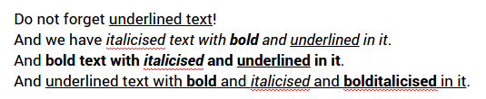
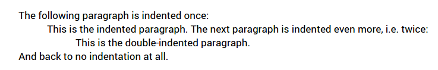
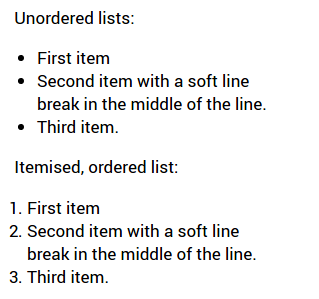
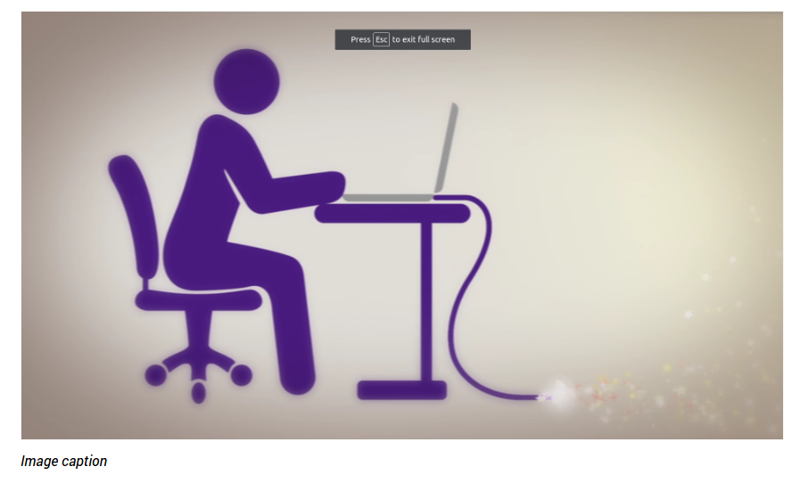
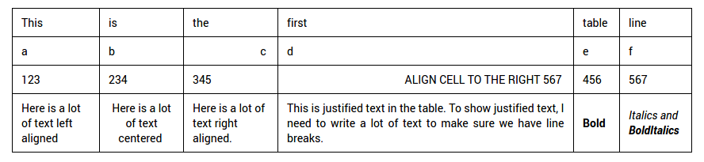
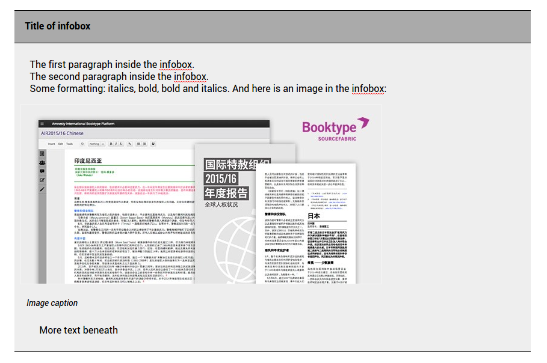
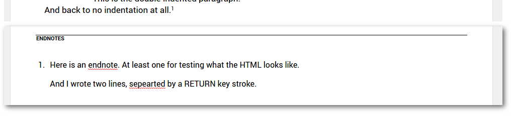

# Inline Plugins

## Bold, Italics, Underline

Editor view:



Raw HTML in DB:

```
<p>Do not forget <span><u>underlined text</u></span>!</p>
<p>And we have <i>italicised text with <b>bold</b> and <span><u>underlined</u></span> in it</i>.&nbsp;</p>
<p>And <b>bold text with <i>italicised</i> and <span><u>underlined</u></span> in it</b>.</p>
<p>And <span><u>underlined text with </u><u><b>bold</b></u><u> and </u><u><i>italicised</i></u><u> and </u><u><b>bolditalicised</b></u><u> in it</u></span>.</p>
```

## Indentation

Editor view:



Raw HTML in DB:

```
<p>The following paragraph is indented once:</p>
<p style="margin-left: 48px;">This is the indented paragraph. The next paragraph is indented even more, i.e. twice:</p>
<p style="margin-left: 96px;">This is the double-indented paragraph.&nbsp;</p>
<p>And back to no indentation at all.</p>
```

## Lists

Editor view:



Raw HTML in DB:

```
<p>Unordered lists:</p>
<ul>
  <li>First item</li>
  <li>Second item with a soft line<br>break in the middle of the line.</li>
  <li>Third item.</li>
</ul>
<p>Itemised, ordered list:</p>
<ol>
  <li>First item</li>
  <li>Second item with a soft line<br>break in the middle of the line.</li>
  <li>Third item.</li>
</ol>
```

# Block Plugins

## Image

Editor view:



Raw HTML in DB:

```
<div class="group_img">
  <div class="image bk-image-editor" style="width: 895.907px; height: 504.471px;">
    
  </div>
  <div class="caption_small">Image caption</div>
</div>
```

## Tables

### Table with inline formatting in cells

Editor view:



Raw HTML in DB:

```
<div class="group_table">
    <table>
        <tbody>
            <tr>
                <td>This</td>
                <td>is</td>
                <td>the</td>
                <td>first</td>
                <td>table</td>
                <td>line</td>
            </tr>
            <tr>
                <td>a</td>
                <td>b</td>
                <td style="text-align: right;">c</td>
                <td>d</td>
                <td>e</td>
                <td>f</td>
            </tr>
            <tr>
                <td>123</td>
                <td>234</td>
                <td>345</td>
                <td style="text-align: right;">ALIGN CELL TO THE RIGHT 567</td>
                <td>456</td>
                <td>567</td>
            </tr>
            <tr>
                <td>Here is a lot of text left aligned</td>
                <td style="text-align: center;">Here is a lot of text centered</td>
                <td style="text-align: right;">Here is a lot of text right aligned.</td>
                <td style="text-align: justify;">This is justified text in the table. To show justified text, I need to write a lot of text to make sure we have line                 breaks.</td>
                <td><b>Bold</b></td>
                <td><i>Italics and <b>BoldItalics</b></i></td>
            </tr>
        </tbody>
    </table>
</div>
```

### Table with caption

Editor view:


Raw HTML in DB:

```
<div class="group_table">
  <p class="caption_table">Here is the table caption</p>
  <table>
    <tbody>
      <tr>
        <td>Left</td>
        <td style="text-align: right;">Right</td>
      </tr>
    </tbody>
  </table>
</div>
```

## Infobox

Editor view:



Raw HTML in DB:

```
<div class="bk-box">
    <div class="box-caption">
        <p>Title of infobox</p>
    </div>
    <div class="box-content">
        <p style="">The first paragraph inside the infobox.</p>
        <p style="">The second paragraph inside the infobox.</p>
        <p style="">Some formatting: <i>italics</i>, <b>bold</b>, <b><i>bold and italics</i></b>. And here is an image in the infobox:</p>
        <div class="group_img">
            <div class="image bk-image-editor" style="width: 627.972px; height: 313.986px;">
                
            </div>
            <div class="caption_small">Image caption</div>
        </div>
        <p class="aloha-editing-p" style="">More text beneath</p>
     </div>
 </div>
```

## Endnote

Editor view:



Raw HTML in DB:

```
<p>And back to no indentation at all.<sup class="endnote" data-id="1489675977420">1</sup></p>
(...)
<ol class="endnotes" dir="ltr">
  <li id="endnote-1489675977420">
    <p>Here is an endnote. At least one for testing what the HTML looks like.</p>
    <p>And I wrote two lines, sepearted by a RETURN key stroke.</p>
  </li>
</ol>
```

